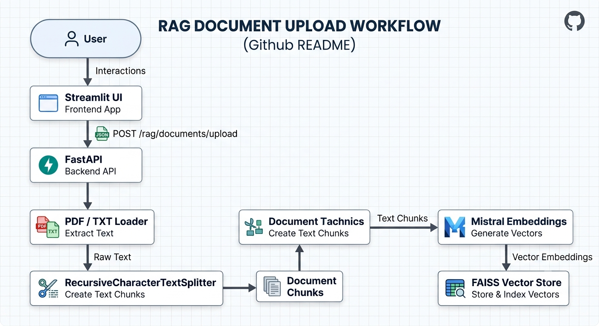

# Adaptive RAG: AI Document Search and Chatbot

An adaptive Retrieval-Augmented Generation (RAG) application that allows users to upload PDF/TXT documents and ask questions about their content. The system combines semantic retrieval with Mistral-based generation, while MongoDB stores conversation history.

## Features

- Upload PDF and TXT documents for question answering
- Automatic document parsing and text chunking
- Mistral embeddings for semantic representation
- In-memory FAISS vector search
- Mistral-powered response generation using `mistral-small-latest`
- LangChain and LangGraph-based RAG orchestration
- Query routing for indexed-document, general, and web-search requests
- Tavily-powered web search for search-routed queries
- MongoDB-backed chat history
- Streamlit chat interface
- FastAPI REST API with Swagger documentation
- Reduced retrieval latency through direct FAISS retrieval and top-2 chunk retrieval

## Tech Stack

| CategoryTechnology  |                                |
| ------------------- | ------------------------------ |
| Language            | Python 3.12                    |
| Backend             | FastAPI, Uvicorn               |
| Frontend            | Streamlit                      |
| RAG                 | LangChain, LangGraph           |
| LLM                 | Mistral `mistral-small-latest` |
| Embeddings          | Mistral Embeddings             |
| Vector Store        | FAISS                          |
| Database            | MongoDB                        |
| Web Search          | Tavily                         |
| Document Processing | LangChain Community, PyPDF     |
| Validation          | Pydantic                       |
|                     |                                |

## Architecture & Workflow



Uploaded documents are loaded, split into chunks, embedded using Mistral embeddings, and indexed in FAISS. The current implementation replaces the active global FAISS index whenever a new document is uploaded.

For document-based queries, the current optimized path retrieves relevant chunks directly from FAISS and passes the retrieved context to the generation step. The retriever is configured to return two chunks to reduce prompt size and latency.

MongoDB stores the human and AI messages associated with each session; it does not store the FAISS documents or vectors.

## Project Structure


=======
## Project Structure


```text
Adaptive-Rag/
│
├── src/
│   ├── api/
│   │   └── routes.py                 # FastAPI RAG endpoints
│   │
│   ├── db/
│   │   └── mongo_client.py           # MongoDB client
│   │
│   ├── llms/
│   │   └── openai.py                 # Mistral LLM configuration
│   │
│   ├── memory/
│   │   └── chat_history_mongo.py     # MongoDB chat history
│   │
│   ├── models/
│   │   ├── state.py
│   │   ├── query_request.py
│   │   ├── grade.py
│   │   └── route_identifier.py
│   │
│   ├── rag/
│   │   ├── document_upload.py        # Document loading and chunking
│   │   ├── retriever_setup.py        # FAISS retriever
│   │   ├── graph_builder.py          # LangGraph workflow
│   │   └── reAct_agent.py            # ReAct-related retrieval code
│   │
│   ├── tools/
│   │   ├── common_tools.py
│   │   └── graph_tools.py
│   │
│   └── main.py                       # FastAPI application entry point
│
├── streamlit_app/
│   ├── home.py                       # Streamlit home/auth interface
│   ├── pages/
│   │   └── chat.py                   # Chat and document upload UI
│   └── utils/
│       └── api_client.py             # Backend API client
│
├── requirements.txt
├── README.md
└── .gitignore
The main backend and frontend components are organized under `src/` and `streamlit_app/` respectivel
```
## Installation & Setup

### 1. Clone the Repository

```bash
git clone https://github.com/Sara250702/Adaptive-RAG-AI-Document-Search-and-Chatbo.git
cd Adaptive-Rag

```

### 2. Create a Virtual Environment

```bash
python -m venv venv

```

### 3. Activate the Environment

**Windows PowerShell:**

```powershell
.\venv\Scripts\Activate.ps1

```

**Linux/macOS:**

```bash
source venv/bin/activate

```

### 4. Install Dependencies

```bash
pip install -r requirements.txt

```

### 5. Configure Environment Variables

Create a `.env` file in the project root and add the required credentials.

```env
MISTRAL_API_KEY=your_mistral_api_key
TAVILY_API_KEY=your_tavily_api_key
MONGO_URL=mongodb://localhost:27017

```

## Environment Variables

| VariablePurpose   |                                                                                          |
| ----------------- | ---------------------------------------------------------------------------------------- |
| `MISTRAL_API_KEY` | Authentication for the Mistral LLM                                                       |
| `TAVILY_API_KEY`  | Used when the query is routed to web search                                              |
| `MONGO_URL`       | MongoDB connection configuration; local setup currently uses `mongodb://localhost:27017` |

## Running the Application

The application requires the FastAPI backend and Streamlit frontend to run separately.

### Start the Backend

```bash
python -m uvicorn src.main:app --host 0.0.0.0 --port 8000

```

Backend:

```text
http://127.0.0.1:8000

```

Swagger API documentation:

```text
http://127.0.0.1:8000/docs

```

### Start the Frontend

Open another terminal:

```bash
.\venv\Scripts\Activate.ps1
streamlit run streamlit_app/home.py

```

Streamlit:

```text
http://localhost:8501

```

These are the current documented local startup commands.

## Usage

1. Start the FastAPI backend.
2. Start the Streamlit application.
3. Open `http://localhost:8501`.
4. Upload a PDF or TXT document.
5. Provide a short description of the document.
6. Submit the document for indexing.
7. Ask questions about the uploaded content.
8. The system retrieves relevant document chunks and generates an answer using Mistral.

### Example Document Query

```json
{
  "query": "What is the main topic of the uploaded document?",
  "session_id": "user_123"
}

```

### API Endpoints

#### Query

```http
POST /rag/query

```

Request:

```json
{
  "query": "What topics are covered in the uploaded document?",
  "session_id": "user_123"
}

```

#### Document Upload

```http
POST /rag/documents/upload

```

Required header:

```http
X-Description: Brief description of the document

```

Supported formats:

```text
.pdf
.txt

```

The upload endpoint returns:

```json
{
  "status": true
}

```

## Demo
